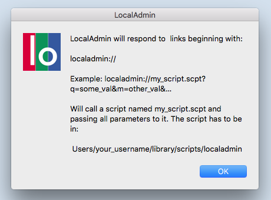
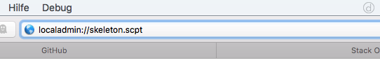
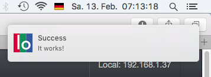
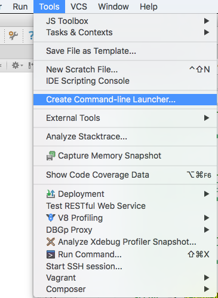
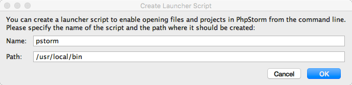
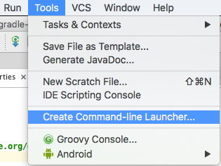
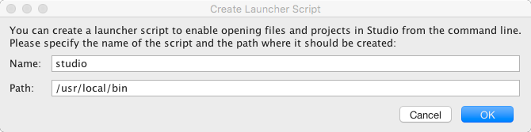

#LocalAdmin-URL-Scheme-Launcher for OS X

Use this URL Scheme Launcher to execute local AppleSripts in your browsers address bar, in a link in your HTML document, via AJAX, … or as addon for [LocalAdmin](https://github.com/JoergHolz/LocalAdmin).

Just call: **localadmin://my_script.scpt**

Of course you can provide parameters **localadmin://my_script.scpt?q=my_value&m=another_value&…** and if your AppleScript returns a message, you will get this message as a notification on your screen.

---

##Table of Contents

[1. Requirements](#1-requirements)   
[2. Installation](#2-installation)   
[3.  Usage](#3-usage)   
[4. Usage for Users of LocalAdmin](#4-usage-for-users-of-localadmin)   
[5. Scripts in Folder «localadmin»](#5-scripts-in-folder-localadmin)   
[6. Credits](#6-credits)   
[7. License](#7-license)   

##1. Requirements

LocalAdmin requires OS X and is tested on OS X 10.11.3

##2. Installation

1. Download and unzip LocalAdmin.zip.

2. Move the app to your application folder.

3. Doubleclick LocalAdmin  
   You will see an info window.
   
   **The first launch is important for signing the url scheme in OS X.**  
   
     
   
4. Click the «OK» button.

5. Move the folder «localadmin» to **Users/your_username/library/scripts/**

6. Open a browser and type:
  
   ```
   localadmin://skeleton.scpt
   ```
   You will get a notification «It work's!».  
   Some browsers are asking for permission, grant it.
   
   

##3. Usage

All AppleScripts have to be in **Users/your_username/library/scripts/localadmin**

Call your scripts by using this URL scheme:

```
localadmin://your_script_name.scpt?your_key1=your_value1&your_key2=your_value2
```

For displaying a notification, just use return in your script:

```
return {title:"Success", msg:"It works!"}
```

 
 

##4. Usage for Users of LocalAdmin
Here are settings for users of [LocalAdmin](https://github.com/JoergHolz/LocalAdmin)

#### Open Project in PhpStorm
```
0 => [
                "platform" => "Mac OS X",
                "browser" => "",
                "type" => "url_scheme",
                "script" => "open_in_phpstorm.scpt",
                "add_to_path" => "",
                "label" => "PhpStorm",
                "tooltip" => "Open in PhpStorm",
                "parameters" => ""
            ]
```

#### Commit Project with PhpStorm
```
0 => [
                "platform" => "Mac OS X",
                "browser" => "",
                "type" => "url_scheme",
                "script" => "commit_with_phpstorm.scpt",
                "add_to_path" => "",
                "label" => "Commit",
                "tooltip" => "Commit with PhpStorm",
                "parameters" => ""
            ]
```


#### Show Project in Finder
```
0 => [
                "platform" => "Mac OS X",
                "browser" => "",
                "type" => "url_scheme",
                "script" => "show_in_finder.scpt",
                "add_to_path" => "",
                "label" => "Finder",
                "tooltip" => "Show in Finder",
                "parameters" => ""
            ]
```

#### Open Project in current Browser and show Developer Tools
```
0 => [
                "platform" => "Mac OS X",
                "browser" => "",
                "type" => "url_scheme",
                "script" => "open_developer_tools_in_cur_browser.scpt",
                "add_to_path" => "",
                "label" => "DeveloperTools",
                "tooltip" => "Open & DeveloperTools",
                "parameters" => ""
            ]
```

#### Open Project in different Browsers
```
0 => [
                "platform" => "Mac OS X",
                "browser" => "",
                "type" => "dropdown",
                "name" => "Browser",
                "items" => [
                    0 => [
                        "type" => "url_scheme",
                        "script" => "open_in_browser.scpt",
                        "add_to_path" => "",
                        "label" => "Safari",
                        "tooltip" => "Open in Safari",
                        "parameters" => "&browser=Safari"
                    ],
                    1 => [
                        "type" => "url_scheme",
                        "script" => "open_in_browser.scpt",
                        "add_to_path" => "",
                        "label" => "Chrome",
                        "tooltip" => "Open in Chrome",
                        "parameters" => "&browser=Google Chrome"
                    ],
                    2 => [
                        "type" => "url_scheme",
                        "script" => "open_in_browser.scpt",
                        "add_to_path" => "",
                        "label" => "Firefox",
                        "tooltip" => "Open in Firefox",
                        "parameters" => "&browser=Firefox"
                    ],
                    3 => [
                        "type" => "url_scheme",
                        "script" => "open_in_browser.scpt",
                        "add_to_path" => "",
                        "label" => "Opera",
                        "tooltip" => "Open in Opera",
                        "parameters" => "&browser=Opera"
                    ]

                ]
            ]
```


#### Open Project in different Browsers and show Developer Tools
```
0 => [
                "platform" => "Mac OS X",
                "browser" => "",
                "type" => "dropdown",
                "name" => "Tools from Browser:",
                "items" => [
                    0 => [
                        "type" => "url_scheme",
                        "script" => "open_developer_tools_in_browser.scpt",
                        "add_to_path" => "",
                        "label" => "Safari",
                        "tooltip" => "Open in Safari",
                        "parameters" => "&browser=Safari"
                    ],
                    1 => [
                        "type" => "url_scheme",
                        "script" => "open_developer_tools_in_browser.scpt",
                        "add_to_path" => "",
                        "label" => "Chrome",
                        "tooltip" => "Open in Chrome",
                        "parameters" => "&browser=Google Chrome"
                    ],
                    2 => [
                        "type" => "url_scheme",
                        "script" => "open_developer_tools_in_browser.scpt",
                        "add_to_path" => "",
                        "label" => "Firefox",
                        "tooltip" => "Open in Firefox",
                        "parameters" => "&browser=Firefox"
                    ],
                    3 => [
                        "type" => "url_scheme",
                        "script" => "open_developer_tools_in_browser.scpt",
                        "add_to_path" => "",
                        "label" => "Opera",
                        "tooltip" => "Open in Opera",
                        "parameters" => "&browser=Opera"
                    ],

                ]
            ]
```

#### Open Project in Android Studio
Remember to configure add_to_path.
```
0 => [
                "platform" => "Mac OS X",
                "browser" => "",
                "type" => "url_scheme",
                "script" => "open_in_android_studio.scpt",
                "add_to_path" => "",
                "label" => "Android Studio",
                "tooltip" => "Open in Android Studio",
                "parameters" => ""
            ]
```

#### Open Project in Xcode
Remember to configure add_to_path.
```
0 => [
                "platform" => "Mac OS X",
                "browser" => "",
                "type" => "url_scheme",
                "script" => "open_in_xcode.scpt",
                "add_to_path" => "",
                "label" => "Xcode",
                "tooltip" => "Open in Xcode",
                "parameters" => ""
            ]
```

#### Runs Xcode project in iOS Simulator
Remember to configure add_to_path.
```
0 => [
                "platform" => "Mac OS X",
                "browser" => "",
                "type" => "url_scheme",
                "script" => "run_in_ios_simulator.scpt",
                "add_to_path" => "",
                "label" => "iOS Simulator",
                "tooltip" => "Run in iOS Simulator",
                "parameters" => ""
            ]
```


#### Open Path in Terminal
Remember to configure add_to_path.
```
0 => [
            "platform" => "Mac OS X",
            "browser" => "",
            "type" => "url_scheme",
            "script" => "open_path_in_terminal.scpt",
            "add_to_path" => "",
            "label" => "Terminal",
            "tooltip" => "Open Path in Terminal",
            "parameters" => ""```
```

##5. Scripts in Folder «localadmin»

#### skeleton.scpt

skeleton.scpt is a template script, copy/rename it and expand it to your needs.

If you use parameters in your link, like:

```
localadmin://your_script_name.scpt?q=12345&x=today
```

and you want to fetch these values in your script, just call:

```
set myVar1 to get_value(params, "q")
set myVar2 to get_value(params, "x")
```

#### show_in_finder.scpt

Opens a path in topmost Finder window, if there is none, it creates a new one.

```
localadmin://show_in_finder.scpt?path=/Users/your_username/path/to/something/
```

#### open_path_in_terminal.scpt

Opens a path in Terminal.


```
localadmin://open_path_in_terminal.scpt?path=/path/to/open/
```

#### terminal_command.scpt

**ATTENTION: Be very careful when you use this script! Terminal commands are powerful.** 

Executes a command in Terminal.

```
localadmin://terminal_command.scpt?script=ls;
```

#### open_in_xcode.scpt

Opens a project in Xcode.

```
localadmin://open_in_xcode.scpt?path=/Users/your_username/path/to/project/
```

#### open_in_phpstorm.scpt

Opens a project in PhpStorm.

```
localadmin://open_in_phpstorm.scpt?path=/Users/your_username/path/to/project/
```

##### Requirements

The script expects the following settings in PhpStorm. Otherwise change the name/path in open_in_phpstorm.scpt.





#### open_in_android_studio.scpt

Opens a project in Android Studio.

```
localadmin://open_in_android_studio.scpt?path=/Users/your_username/path/to/project/
```

##### Requirements

The script expects the following settings in PhpStorm. Otherwise change the name/path in open_in_android_studio.scpt.





##6. Credits

– Christa

– http://www.macosxautomation.com/applescript/linktrigger/

##7. License

MIT License (MIT)

Copyright (c) 2016 Jörg Holz | [https://www.workflow-management.net](https://www.workflow-management.net)

Permission is hereby granted, free of charge, to any person obtaining a copy
of this software and associated documentation files (the "Software"), to deal
in the Software without restriction, including without limitation the rights
to use, copy, modify, merge, publish, distribute, sublicense, and/or sell
copies of the Software, and to permit persons to whom the Software is
furnished to do so, subject to the following conditions:

The above copyright notice and this permission notice shall be included in all
copies or substantial portions of the Software.

THE SOFTWARE IS PROVIDED "AS IS", WITHOUT WARRANTY OF ANY KIND, EXPRESS OR
IMPLIED, INCLUDING BUT NOT LIMITED TO THE WARRANTIES OF MERCHANTABILITY,
FITNESS FOR A PARTICULAR PURPOSE AND NONINFRINGEMENT. IN NO EVENT SHALL THE
AUTHORS OR COPYRIGHT HOLDERS BE LIABLE FOR ANY CLAIM, DAMAGES OR OTHER
LIABILITY, WHETHER IN AN ACTION OF CONTRACT, TORT OR OTHERWISE, ARISING FROM,
OUT OF OR IN CONNECTION WITH THE SOFTWARE OR THE USE OR OTHER DEALINGS IN THE
SOFTWARE.